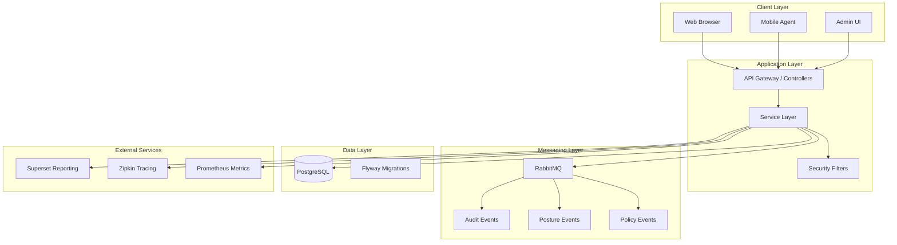
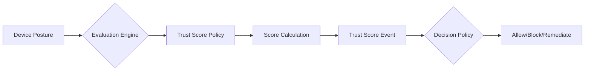
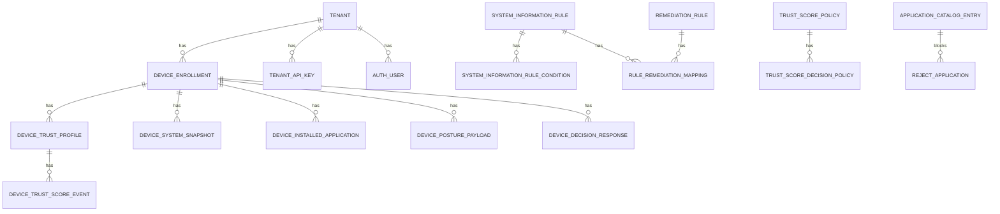
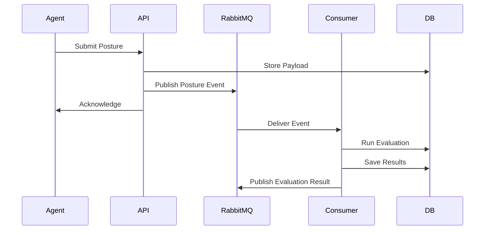

# 24Online MDM (Mobile Device Management)

[](https://openjdk.java.net/)
[](https://spring.io/projects/spring-boot)
[](https://www.postgresql.org/)
[](LICENSE)

> **Enterprise Mobile Device Management platform with real-time trust scoring, policy enforcement, and device posture evaluation.**

---

## 📑 Table of Contents

- [Overview](#overview)
- [Architecture](#architecture)
- [Features](#features)
- [Technology Stack](#technology-stack)
- [Prerequisites](#prerequisites)
- [Quick Start](#quick-start)
- [Configuration](#configuration)
- [Database Schema](#database-schema)
- [API Reference](#api-reference)
- [UI Guide](#ui-guide)
- [Messaging & Events](#messaging--events)
- [Monitoring & Observability](#monitoring--observability)
- [Security](#security)
- [Testing](#testing)
- [Deployment](#deployment)
- [Troubleshooting](#troubleshooting)
- [Contributing](#contributing)
- [License](#license)

---

## 📖 Overview

24Online MDM is a comprehensive **Mobile Device Management** solution designed for enterprise environments. It provides real-time device trust evaluation, policy enforcement, and compliance management through a reactive, event-driven architecture.

### Core Capabilities

| Capability | Description |
|------------|-------------|
| **Device Enrollment** | Secure onboarding with setup keys and agent credentials |
| **Trust Scoring** | Dynamic trust scores based on device posture and behavior |
| **Policy Engine** | Configurable rules for system info, remediation, and access control |
| **Posture Evaluation** | Automated compliance checking with remediation workflows |
| **Application Control** | Catalog-based allow/block lists for installed applications |
| **OS Lifecycle** | Track operating system versions against end-of-life dates |
| **Audit Trail** | Complete audit logging for compliance and forensics |
| **Multi-Tenancy** | Isolated tenant data with granular access control |

---

## 🏗️ Architecture



### Architecture Principles

- **Reactive First**: Built on Spring WebFlux for non-blocking I/O
- **Event-Driven**: Async messaging for audit, posture, and policy events
- **Database Per Tenant**: Logical isolation with tenant_id scoping
- **CQRS Pattern**: Separate read/write models for performance
- **Idempotency**: All write operations are idempotent

---

## ✨ Features

### 1. Device Management

- **Enrollment Flows**: Setup key-based device registration
- **Agent Authentication**: JWT-based agent credentials
- **Device Timeline**: Complete history of device events and decisions
- **De-enrollment**: Secure device removal with data cleanup

### 2. Trust Score System



- Configurable trust score policies
- Real-time score updates
- Historical score tracking
- Decision-based responses

### 3. Policy Center

| Policy Type | Purpose |
|-------------|---------|
| **System Information Rules** | Define OS, hardware, software requirements |
| **Rule Conditions** | Boolean conditions for rule matching |
| **Remediation Rules** | Actions for non-compliant devices |
| **Trust Score Policies** | Scoring weights and thresholds |
| **Trust Decision Policies** | Access control based on scores |

### 4. Posture Evaluation

- **Scheduled Evaluations**: Cron-based compliance checks
- **On-Demand Evaluations**: Manual trigger via API
- **Remediation Workflows**: Automatic fix attempts
- **Evaluation History**: Track all evaluation runs

### 5. Application Catalog

- **Catalog Entries**: Known application definitions
- **Reject Lists**: Blocked applications by bundle ID/hash
- **Soft Delete**: Recoverable deletion with audit trail

### 6. OS Lifecycle Management

- **OS Version Master**: Track Windows/macOS/Linux versions
- **Lifecycle Dates**: Release date, end of support, EOL
- **Compliance Reporting**: Identify outdated OS versions

### 7. Multi-Tenancy

- **Tenant Isolation**: All queries scoped by tenant_id
- **Tenant Admin Role**: Per-tenant administration
- **API Key Rotation**: Secure key management

---

## 🛠️ Technology Stack

### Backend

| Technology | Version | Purpose |
|------------|---------|---------|
| Java | 17+ | Runtime |
| Spring Boot | 3.x | Application Framework |
| Spring WebFlux | 3.x | Reactive Web |
| Spring Data R2DBC | 3.x | Reactive Database |
| Spring Security | 3.x | Authentication & Authorization |
| Flyway | 9.x | Database Migrations |
| Log4j2 | 2.x | Logging |

### Database

| Technology | Version | Purpose |
|------------|---------|---------|
| PostgreSQL | 14+ | Primary Database |
| pgcrypto | - | Cryptographic functions |
| btree_gin | - | Indexing support |

### Messaging

| Technology | Version | Purpose |
|------------|---------|---------|
| RabbitMQ | 3.x | Event Bus |
| Spring AMQP | 3.x | Messaging Integration |

### Frontend

| Technology | Purpose |
|------------|---------|
| Thymeleaf | Server-side templates |
| Vanilla JavaScript | Client-side logic |
| Custom CSS | Styling (no framework) |
| DataTables | Table rendering |
| QRCode.js | QR code generation |

### DevOps & Monitoring

| Technology | Purpose |
|------------|---------|
| Docker | Containerization |
| Prometheus | Metrics collection |
| Zipkin | Distributed tracing |
| Apache Superset | Embedded reporting |
| Grafana | Dashboards (optional) |

---

## 📋 Prerequisites

### Required

- **Java**: OpenJDK 17 or later
- **PostgreSQL**: Version 14 or later
- **Maven**: 3.8+ (or use included Maven wrapper)

### Optional

- **Node.js**: 18+ (for package management)
- **Docker**: 20+ (for containerized deployment)
- **RabbitMQ**: 3.x (for async messaging)
- **Git**: 2.x (for version control)

### Verify Installation

```bash
# Check Java
java -version

# Check PostgreSQL
psql --version

# Check Maven
mvn --version
```

---

## 🚀 Quick Start

### 1. Clone the Repository

```bash
git clone https://github.com/krishanuacharya-24online/24ONLINEMDM.git
cd 24ONLINEMDM
```

### 2. Database Setup

```sql
-- Create database
CREATE DATABASE mdm;

-- Create user (optional)
CREATE USER mdm_user WITH PASSWORD 'your_secure_password';
GRANT ALL PRIVILEGES ON DATABASE mdm TO mdm_user;
```

### 3. Configure Application

Edit `src/main/resources/application.yaml`:

```yaml
spring:
  datasource:
    url: jdbc:postgresql://localhost:5432/mdm
    username: postgres
    password: your_password
  r2dbc:
    url: r2dbc:postgresql://localhost:5432/mdm
    username: postgres
    password: your_password
```

### 4. Run the Application

```bash
# Using Maven wrapper
./mvnw spring-boot:run

# Or build and run JAR
./mvnw clean package
java -jar target/*.jar
```

### 5. Access the Application

| Interface | URL | Credentials |
|-----------|-----|-------------|
| Web UI | http://localhost:8080 | admin / admin |
| API | http://localhost:8080/api/v2 | JWT Token |
| Actuator | http://localhost:8080/actuator | - |
| Health | http://localhost:8080/health | - |

⚠️ **Change the default admin password immediately!**

---

## ⚙️ Configuration

### Environment Variables

| Variable | Default | Description |
|----------|---------|-------------|
| `SPRING_DATASOURCE_URL` | jdbc:postgresql://localhost:5432/mdm | Database URL |
| `SPRING_DATASOURCE_USERNAME` | postgres | Database username |
| `SPRING_DATASOURCE_PASSWORD` | - | Database password |
| `SERVER_PORT` | 8080 | HTTP port |
| `JWT_SECRET` | (random) | JWT signing key |
| `JWT_EXPIRATION_MS` | 86400000 | Token validity (ms) |
| `TENANT_ID_HEADER` | X-Tenant-ID | Tenant header name |

### Application Profiles

| Profile | Purpose |
|---------|---------|
| `default` | Standard configuration |
| `aot` | Ahead-of-Time compilation |
| `dev` | Development settings |
| `prod` | Production settings |

### Configuration Files

```
src/main/resources/
├── application.yaml          # Main configuration
├── application-aot.yaml      # AOT profile
├── log4j2.xml               # Logging configuration
└── db/migration/            # Flyway migrations
```

---

## 🗃️ Database Schema

### Core Entities



### Key Tables

| Table | Purpose |
|-------|---------|
| `tenant` | Multi-tenant isolation |
| `device_enrollment` | Registered devices |
| `device_trust_profile` | Current trust state |
| `device_trust_score_event` | Score history |
| `system_information_rule` | Policy rules |
| `posture_evaluation_run` | Evaluation history |
| `policy_change_audit` | Audit trail |
| `audit_event_log` | General audit log |

### Migrations

Flyway migrations are in `src/main/resources/db/migration/`:

| Version | Description |
|---------|-------------|
| V001 | Extensions (pgcrypto, btree_gin) |
| V002 | Reject application list |
| V003 | Core schema |
| V004 | OS lifecycle master |
| V005 | Schema optimization |
| V006 | Tenant master |
| V007 | Auth users and tokens |
| V008+ | Additional features |

---

## 🌐 API Reference

### Authentication

#### Get Token
```bash
curl -X POST http://localhost:8080/api/v2/auth/token \
  -H "Content-Type: application/json" \
  -d '{"username":"admin","password":"admin"}'
```

Response:
```json
{
  "token": "eyJhbGciOiJIUzI1NiIsInR5cCI6IkpXVCJ9...",
  "expiresIn": 86400000
}
```

### Device APIs

#### List Devices
```bash
curl -X GET http://localhost:8080/api/v2/devices \
  -H "Authorization: Bearer <token>"
```

#### Get Device Timeline
```bash
curl -X GET http://localhost:8080/api/v2/devices/{deviceId}/timeline \
  -H "Authorization: Bearer <token>"
```

### Policy APIs

#### List Trust Score Policies
```bash
curl -X GET http://localhost:8080/api/v2/policies/trust-score \
  -H "Authorization: Bearer <token>"
```

#### Create Trust Score Policy
```bash
curl -X POST http://localhost:8080/api/v2/policies/trust-score \
  -H "Authorization: Bearer <token>" \
  -H "Content-Type: application/json" \
  -d '{
    "name": "Default Trust Policy",
    "osType": "windows",
    "minTrustScore": 50
  }'
```

### Agent APIs

#### Register Device
```bash
curl -X POST http://localhost:8080/api/v2/agent/register \
  -H "X-API-Key: <tenant-api-key>" \
  -H "Content-Type: application/json" \
  -d '{
    "deviceName": "DESKTOP-ABC123",
    "osType": "windows",
    "osVersion": "10.0.19041"
  }'
```

#### Submit Posture Payload
```bash
curl -X POST http://localhost:8080/api/v2/agent/posture \
  -H "Authorization: Bearer <agent-token>" \
  -H "Content-Type: application/json" \
  -d '{
    "systemSnapshot": {...},
    "installedApplications": [...]
  }'
```

### API Versioning

| Version | Status | Base Path |
|---------|--------|-----------|
| v1 | Deprecated | `/api/v1` |
| v2 | Current | `/api/v2` |

---

## 🖥️ UI Guide

### Pages

| Page | Path | Description |
|------|------|-------------|
| Login | `/login` | Admin authentication |
| Overview | `/` | Dashboard with metrics |
| Devices | `/devices` | Device list and management |
| Enrollments | `/enrollments` | Device enrollment status |
| Payloads | `/payloads` | Device posture data |
| Policies | `/policies/*` | Policy management screens |
| Tenants | `/tenants` | Tenant administration |
| Users | `/users` | User management |
| Reports | `/reports` | Embedded Superset dashboards |
| Audit Trail | `/audit-trail` | Audit log viewer |

### Navigation

```
┌─────────────────────────────────────────────┐
│  24Online MDM           [User ▼]            │
├──────────┬──────────────────────────────────┤
│ Overview │                                  │
│ Devices  │    Main Content Area             │
│ Enroll.  │                                  │
│ Payloads │                                  │
│ Policies ▼                                  │
│ Tenants  │                                  │
│ Users    │                                  │
│ Reports  │                                  │
└──────────┴──────────────────────────────────┘
```

---

## 📨 Messaging & Events

### RabbitMQ Queues

| Queue | Purpose |
|-------|---------|
| `mdm.audit.events` | Audit event logging |
| `mdm.posture.payload` | Posture ingestion |
| `mdm.posture.evaluation` | Evaluation triggers |
| `mdm.policy.audit` | Policy change audit |

### Event Flow



---

## 📊 Monitoring & Observability

### Actuator Endpoints

| Endpoint | Description |
|----------|-------------|
| `/actuator/health` | Health status |
| `/actuator/info` | Application info |
| `/actuator/metrics` | Metrics |
| `/actuator/prometheus` | Prometheus format |
| `/actuator/env` | Environment properties |
| `/actuator/beans` | Spring beans |

### Prometheus Metrics

```yaml
# Example policy-alert-rules.yml
groups:
  - name: MDM Alerts
    rules:
      - alert: HighErrorRate
        expr: rate(http_server_requests_errors_total[5m]) > 0.1
        annotations:
          summary: "High error rate detected"
```

### Zipkin Tracing

Enable distributed tracing:
```yaml
management:
  zipkin:
    tracing:
      endpoint: http://localhost:9411/api/v2/spans
  tracing:
    sampling:
      probability: 1.0
```

### Superset Reporting

Embedded dashboards accessible at `/reports`:
- Device compliance overview
- Trust score distribution
- Policy evaluation statistics
- Audit trail analysis

---

## 🔒 Security

### Authentication

- **Admin Users**: JWT-based authentication
- **Device Agents**: Bearer tokens with device scope
- **Tenant APIs**: API key authentication

### Authorization

| Role | Permissions |
|------|-------------|
| `ADMIN` | Full access |
| `TENANT_ADMIN` | Tenant-scoped admin |
| `DEVICE` | Device-only operations |

### Password Policy

- Minimum 8 characters
- Not in breached passwords list (HaveIBeenPwned)
- SHA-512 hashing with salt

### Security Headers

```java
// Configured in SecurityConfig.java
- X-Content-Type-Options: nosniff
- X-Frame-Options: DENY
- X-XSS-Protection: 1; mode=block
- Content-Security-Policy: default-src 'self'
```

---

## 🧪 Testing

### Run Tests

```bash
# All tests
./mvnw test

# With coverage
./mvnw test jacoco:report

# Specific test class
./mvnw test -Dtest=DeviceEnrollmentServiceTest
```

### Test Structure

```
src/test/java/com/e24online/mdm/
├── config/           # Configuration tests
├── messaging/        # Message consumer/producer tests
├── records/          # Record coverage tests
├── repository/       # Repository tests
├── service/          # Service layer tests
├── web/              # Controller tests
└── dto/              # DTO coverage tests
```

### Coverage Report

After running `./mvnw test jacoco:report`, open:
```
target/site/jacoco/index.html
```

---

## 🚢 Deployment

### Docker Deployment

```bash
# Build image
docker build -t 24online/mdm:latest .

# Run container
docker run -p 8080:8080 \
  -e SPRING_DATASOURCE_URL=jdbc:postgresql://db:5432/mdm \
  -e SPRING_DATASOURCE_PASSWORD=secret \
  24online/mdm:latest
```

### Docker Compose

```yaml
# docker-compose.yml
services:
  app:
    image: 24online/mdm:latest
    ports:
      - "8080:8080"
    environment:
      - SPRING_DATASOURCE_URL=jdbc:postgresql://db:5432/mdm
    depends_on:
      - db
  
  db:
    image: postgres:14
    environment:
      - POSTGRES_DB=mdm
      - POSTGRES_PASSWORD=secret
    volumes:
      - pgdata:/var/lib/postgresql/data

volumes:
  pgdata:
```

### Production Checklist

- [ ] Change default admin password
- [ ] Configure HTTPS/TLS
- [ ] Set secure JWT secret
- [ ] Enable audit logging
- [ ] Configure backup strategy
- [ ] Set up monitoring alerts
- [ ] Review security headers
- [ ] Configure rate limiting

---

## 🔧 Troubleshooting

### Common Issues

#### Database Connection Failed
```
Error: Connection refused to localhost:5432
```
**Solution**: Ensure PostgreSQL is running and credentials are correct.

#### Flyway Migration Failed
```
Error: Validate failed - Detected applied migration not resolved
```
**Solution**: Check `schema_version` table and ensure migrations are in order.

#### JWT Token Expired
```
Error: 401 Unauthorized - Token expired
```
**Solution**: Request a new token via `/api/v2/auth/token`.

#### RabbitMQ Connection Lost
```
Warning: Connection to RabbitMQ lost, retrying...
```
**Solution**: Check RabbitMQ service status and network connectivity.

### Debug Mode

Enable debug logging:
```yaml
logging:
  level:
    com.e24online.mdm: DEBUG
    org.springframework: DEBUG
```

### Log Files

Logs are written to:
- Console (stdout)
- `logs/application.log` (if configured)

---

## 🤝 Contributing

### Development Workflow

1. Fork the repository
2. Create a feature branch (`git checkout -b feature/amazing-feature`)
3. Commit changes (`git commit -m 'Add amazing feature'`)
4. Push to branch (`git push origin feature/amazing-feature`)
5. Open a Pull Request

### Code Style

- Java: Follow Spring Framework conventions
- Naming: CamelCase for classes, snake_case for database
- Documentation: JavaDoc for public methods

### Commit Messages

```
feat: Add new trust score policy endpoint
fix: Resolve NPE in device timeline service
docs: Update API documentation
test: Add integration tests for enrollment flow
```

---

## 📄 License

**Proprietary** - 24Online Ltd. All rights reserved.

This software is confidential and proprietary. Unauthorized copying, distribution, or use is strictly prohibited.

---

## 👥 Support

- **GitHub Issues**: [Report bugs or request features](https://github.com/krishanuacharya-24online/24ONLINEMDM/issues)
- **Email**: support@24online.tech
- **Documentation**: See `docs/` folder for detailed guides

---

## 📚 Additional Documentation

| Document | Location |
|----------|----------|
| API Specification | `docs/openapi/` |
| Policy Center Guide | `docs/POLICY_CENTER_GUIDE.md` |
| Agent API Usage | `docs/AGENT_APP_API_USAGE.md` |
| Auth API Usage | `docs/AUTH_API_USAGE.md` |
| Ops Runbooks | `docs/ops/` |
| Schema Reference | `docs/MDM_SCHEMA_LOGIC_REFERENCE.md` |

---

*Last updated: March 2026*
