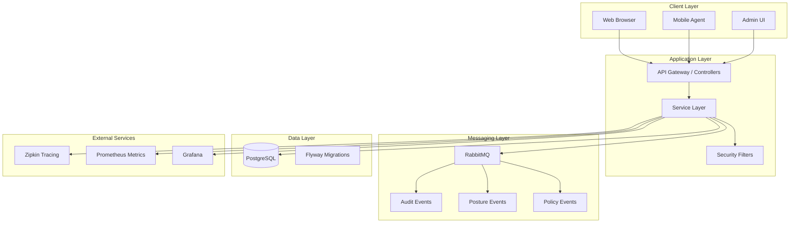
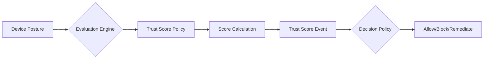
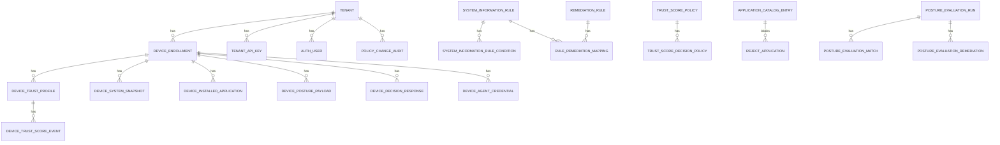
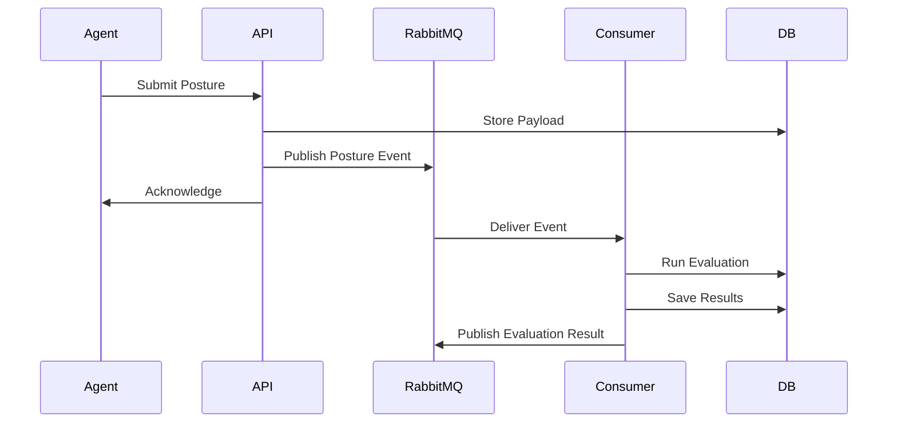

# 24Online Device Posture Platform

[](https://openjdk.java.net/)
[](https://spring.io/projects/spring-boot)
[](https://www.postgresql.org/)
[](LICENSE)

> **Multi-tenant SaaS device posture, compliance, and trust-evaluation platform with manual remediation guidance.**

Repository note: the repository name remains `24onlinemdm` for continuity, but the frozen product scope is not full MDM.

Canonical planning documents:

- `docs/FROZEN_PRODUCT_REQUIREMENTS.md`
- `docs/IMPLEMENTATION_ROADMAP_FINAL.md`
- `docs/AGENT_APP_API_USAGE.md`
- `tools/24onlineMDMAgent/README.md`

Desktop agent:

- desktop app: `tools/24onlineMDMAgent`

---

## 📑 Table of Contents

- [Overview](#overview)
- [Architecture](#architecture)
- [Features](#features)
- [Technology Stack](#technology-stack)
- [Prerequisites](#prerequisites)
- [Quick Start](#quick-start)
- [Configuration](#configuration)
- [Database Schema](#database-schema)
- [API Reference](#api-reference)
- [UI Guide](#ui-guide)
- [Messaging & Events](#messaging--events)
- [Monitoring & Observability](#monitoring--observability)
- [Security](#security)
- [Testing](#testing)
- [Deployment](#deployment)
- [Troubleshooting](#troubleshooting)
- [Contributing](#contributing)
- [License](#license)

---

## 📖 Overview

24Online is a multi-tenant device posture and compliance platform designed for enterprise environments. It provides real-time device trust evaluation, policy enforcement, and remediation guidance through a reactive, event-driven architecture.

### Core Capabilities

| Capability | Description |
|------------|-------------|
| **Device Enrollment** | Secure onboarding with setup keys and agent credentials |
| **Trust Scoring** | Dynamic trust scores based on device posture and behavior |
| **Policy Engine** | Configurable rules for system info, remediation, and access control |
| **Posture Evaluation** | Automated compliance checking with remediation workflows |
| **Application Catalog** | Manage allowed/blocked applications |
| **OS Lifecycle** | Track operating system versions and end-of-life dates |
| **Audit Trail** | Complete audit logging for compliance and forensics |
| **Multi-Tenancy** | Isolated tenant data with API key authentication |

---

## 🏗️ Architecture



### Architecture Principles

- **Reactive First**: Built on Spring WebFlux for non-blocking I/O
- **Event-Driven**: Async messaging for audit, posture, and policy events
- **Database Per Tenant**: Logical isolation with tenant_id scoping
- **CQRS Pattern**: Separate read/write models for performance
- **Idempotency**: All write operations are idempotent
- **Virtual Threads**: Leverages Java 25 virtual threads for concurrency

---

## ✨ Features

### 1. Device Management

- **Enrollment Flows**: Setup key-based device registration
- **Agent Authentication**: JWT-based agent credentials
- **Device Timeline**: Complete history of device events and decisions
- **De-enrollment**: Secure device removal with data cleanup

### 2. Trust Score System



- Configurable trust score policies
- Real-time score updates
- Historical score tracking
- Decision-based responses

### 3. Policy Center

| Policy Type | Purpose |
|-------------|---------|
| **System Information Rules** | Define OS, hardware, software requirements |
| **Rule Conditions** | Boolean conditions for rule matching |
| **Remediation Rules** | Actions for non-compliant devices |
| **Trust Score Policies** | Scoring weights and thresholds |
| **Trust Decision Policies** | Access control based on scores |

### 4. Posture Evaluation

- **Scheduled Evaluations**: Cron-based compliance checks
- **On-Demand Evaluations**: Manual trigger via API
- **Remediation Workflows**: Automatic fix attempts
- **Evaluation History**: Track all evaluation runs

### 5. Application Catalog

- **Catalog Entries**: Known application definitions
- **Reject Lists**: Blocked applications by bundle ID/hash
- **Soft Delete**: Recoverable deletion with audit trail

### 6. OS Lifecycle Management

- **OS Version Master**: Track Windows/macOS/Linux versions
- **Lifecycle Dates**: Release date, end of support, EOL
- **Compliance Reporting**: Identify outdated OS versions

### 7. Multi-Tenancy

- **Tenant Isolation**: All queries scoped by tenant_id
- **Tenant Admin Role**: Per-tenant administration
- **API Key Rotation**: Secure key management

### 8. Lookup Tables

- **Reference Data Management**: Admin-managed lookup tables
- **Sync State Tracking**: Track external data synchronization
- **Data Normalization**: Normalize device data against lookups

---

## 🛠️ Technology Stack

### Backend

| Technology | Version | Purpose |
|------------|---------|---------|
| Java | 25 | Runtime with virtual threads |
| Spring Boot | 4.0.3 | Application Framework |
| Spring WebFlux | 4.0.3 | Reactive Web |
| Spring Data JDBC | 4.0.3 | Database Access |
| Spring Security | 4.0.3 | Authentication & Authorization |
| Flyway | 12.0.3 | Database Migrations |
| Log4j2 | 2.x | Logging |
| Resilience4j | 2.3.0 | Rate limiting & retries |
| Lombok | - | Boilerplate reduction |

### Database

| Technology | Version | Purpose |
|------------|---------|---------|
| PostgreSQL | 18 | Primary Database |
| pgcrypto | - | Cryptographic functions |
| btree_gin | - | Indexing support |

### Messaging

| Technology | Version | Purpose |
|------------|---------|---------|
| RabbitMQ | 3.13 | Event Bus |
| Spring AMQP | 4.x | Messaging Integration |

### Frontend

| Technology | Purpose |
|------------|---------|
| Thymeleaf | Server-side templates |
| Vanilla JavaScript | Client-side logic |
| Custom CSS | Styling (no framework) |
| DataTables | Table rendering |
| QRCode.js | QR code generation |
| Select2-lite | Dropdown enhancement |

### DevOps & Monitoring

| Technology | Purpose |
|------------|---------|
| Docker | Containerization |
| Prometheus | Metrics collection |
| Zipkin | Distributed tracing |
| Native reporting UI | Fleet, remediation, and operations reporting |
| Grafana | Dashboards (optional) |

### Build Tools

| Technology | Version | Purpose |
|------------|---------|---------|
| Maven | 3.x | Build automation |
| GraalVM Native | 0.10.6 | Native image compilation |
| esbuild | 0.25.1 | JavaScript bundling |
| JavaScript Obfuscator | 4.1.1 | Code protection |

---

## 📋 Prerequisites

### Required

- **Java**: OpenJDK 25
- **PostgreSQL**: Version 18 (via Docker or local)
- **Maven**: 3.8+ (or use included Maven wrapper)

### Optional

- **Node.js**: 18+ (for JavaScript asset building)
- **Docker**: 20+ (for containerized deployment)
- **RabbitMQ**: 3.13 (for async messaging - included in docker-compose)
- **Git**: 2.x (for version control)

### Verify Installation

```bash
# Check Java
java -version
# Should show: openjdk version "25.x.x"

# Check PostgreSQL (if installed locally)
psql --version

# Check Maven
mvn --version
```

---

## 🚀 Quick Start

### 1. Clone the Repository

```bash
git clone https://github.com/krishanuacharya-24online/24ONLINEMDM.git
cd 24ONLINEMDM
```

### 2. Quick Start with Docker (Recommended)

```bash
# Start all services (PostgreSQL, RabbitMQ, Zipkin)
docker-compose up -d

# Wait for services to be healthy (check with:)
docker-compose ps
```

### 3. Configure Application

The default configuration uses these environment variables:

| Variable | Default | Description |
|----------|---------|-------------|
| `POSTGRES_HOST` | localhost | Database host |
| `POSTGRES_PORT` | 5433 | Database port (mapped) |
| `POSTGRES_DB` | mdm | Database name |
| `POSTGRES_USER` | mdm | Database username |
| `POSTGRES_PASSWORD` | mdm | Database password |
| `RABBITMQ_HOST` | localhost | RabbitMQ host |
| `RABBITMQ_PORT` | 5672 | RabbitMQ port |

### 4. Run the Application

```bash
# Using Maven wrapper
./mvnw spring-boot:run

# Or build and run JAR
./mvnw clean package
java -jar target/24onlinemdm.jar
```

### 5. Access the Application

| Interface | URL | Credentials |
|-----------|-----|-------------|
| Web UI | http://localhost:8080 | admin / admin |
| API | http://localhost:8080/api/v1 | JWT Token |
| Actuator | http://localhost:8080/actuator | - |
| Health | http://localhost:8080/health | - |
| Zipkin | http://localhost:9411 | - |
| RabbitMQ Mgmt | http://localhost:15672 | guest / guest |

⚠️ **Change the default admin password immediately!**

---

## ⚙️ Configuration

### Environment Variables

| Variable | Default | Description |
|----------|---------|-------------|
| `POSTGRES_HOST` | localhost | Database host |
| `POSTGRES_PORT` | 5433 | Database port |
| `POSTGRES_DB` | mdm | Database name |
| `POSTGRES_USER` | mdm | Database username |
| `POSTGRES_PASSWORD` | mdm | Database password |
| `HIKARI_MAX_POOL_SIZE` | 100 | Connection pool max size |
| `HIKARI_MIN_IDLE` | 10 | Connection pool min idle |
| `RABBITMQ_HOST` | localhost | RabbitMQ host |
| `RABBITMQ_PORT` | 5672 | RabbitMQ port |
| `RABBITMQ_USER` | guest | RabbitMQ username |
| `RABBITMQ_PASSWORD` | guest | RabbitMQ password |
| `RABBITMQ_VHOST` | / | RabbitMQ virtual host |
| `ZIPKIN_PORT` | 9411 | Zipkin tracing port |
| `TRACING_ENABLED` | true | Enable distributed tracing |
| `TRACING_SAMPLING_PROBABILITY` | 1.0 | Tracing sample rate |
| `MANAGEMENT_ALLOWED_CIDRS` | 127.0.0.1/32,::1/128 | Allowed actuator CIDRs |

### API Configuration

```yaml
api:
  version:
    prefix: v1
  pagination:
    default-page: 0
    default-size: 50
    max-size: 500
    max-page: 1000
```

### Application Profiles

| Profile | Purpose |
|---------|---------|
| `default` | Standard configuration |
| `aot` | Ahead-of-Time native compilation |

### Configuration Files

```
src/main/resources/
├── application.yaml          # Main configuration
├── application-aot.yaml      # AOT profile
├── log4j2.xml               # Logging configuration
└── db/migration/            # Flyway migrations (V001-V023)
```

---

## 🗃️ Database Schema

### Core Entities



### Key Tables

| Table | Purpose |
|-------|---------|
| `tenant` | Multi-tenant isolation |
| `device_enrollment` | Registered devices |
| `device_trust_profile` | Current trust state |
| `device_trust_score_event` | Score history |
| `system_information_rule` | Policy rules |
| `posture_evaluation_run` | Evaluation history |
| `policy_change_audit` | Audit trail |
| `audit_event_log` | General audit log |
| `os_release_lifecycle_master` | OS version tracking |
| `application_catalog_entry` | Application catalog |
| `reject_application` | Blocked applications |
| `lookup_*` | Reference data tables |

### Migrations

Flyway migrations are in `src/main/resources/db/migration/`:

| Version | Description |
|---------|-------------|
| V001 | Extensions (pgcrypto, btree_gin) |
| V002 | Reject application list |
| V003 | Core schema |
| V004 | OS lifecycle master |
| V005 | Schema optimization |
| V006 | Tenant master |
| V007 | Auth users and tokens |
| V008 | Seed default admin |
| V009-V010 | Password migration to SHA-512 |
| V011 | Tenant API keys |
| V012-V017 | Device enrollment enhancements |
| V018-V023 | Posture queue, policy audit, reference sync |

---

## 🌐 API Reference

### Base URL

```
http://localhost:8080/api/v1
```

### Authentication

#### Get Token
```bash
curl -X POST http://localhost:8080/api/v1/auth/token \
  -H "Content-Type: application/json" \
  -d '{"username":"admin","password":"admin"}'
```

Response:
```json
{
  "token": "eyJhbGciOiJIUzI1NiIsInR5cCI6IkpXVCJ9...",
  "expires_in": 86400000
}
```

### Device APIs

#### List Devices
```bash
curl -X GET http://localhost:8080/api/v1/devices \
  -H "Authorization: Bearer <token>"
```

#### Get Device Timeline
```bash
curl -X GET http://localhost:8080/api/v1/devices/{deviceId}/timeline \
  -H "Authorization: Bearer <token>"
```

### Policy APIs

#### List Trust Score Policies
```bash
curl -X GET http://localhost:8080/api/v1/policies/trust-score \
  -H "Authorization: Bearer <token>"
```

#### Create Trust Score Policy
```bash
curl -X POST http://localhost:8080/api/v1/policies/trust-score \
  -H "Authorization: Bearer <token>" \
  -H "Content-Type: application/json" \
  -d '{
    "name": "Default Trust Policy",
    "os_type": "windows",
    "min_trust_score": 50
  }'
```

### Agent APIs

#### Register Device
```bash
curl -X POST http://localhost:8080/api/v1/agent/register \
  -H "X-API-Key: <tenant-api-key>" \
  -H "Content-Type: application/json" \
  -d '{
    "device_name": "DESKTOP-ABC123",
    "os_type": "windows",
    "os_version": "10.0.19041"
  }'
```

#### Submit Posture Payload
```bash
curl -X POST http://localhost:8080/api/v1/agent/posture \
  -H "Authorization: Bearer <agent-token>" \
  -H "Content-Type: application/json" \
  -d '{
    "system_snapshot": {...},
    "installed_applications": [...]
  }'
```

### API Endpoints

| Endpoint | Method | Description |
|----------|--------|-------------|
| `/auth/token` | POST | Get JWT token |
| `/devices` | GET | List devices |
| `/devices/{id}` | GET | Get device details |
| `/devices/{id}/timeline` | GET | Get device timeline |
| `/enrollments` | GET | List enrollments |
| `/policies/trust-score` | GET/POST | Manage trust score policies |
| `/policies/system-rules` | GET/POST | Manage system information rules |
| `/policies/remediation` | GET/POST | Manage remediation rules |
| `/policies/decision` | GET/POST | Manage trust decision policies |
| `/agent/register` | POST | Register device |
| `/agent/posture` | POST | Submit posture data |
| `/catalog` | GET/POST | Manage application catalog |
| `/lookups` | GET/POST | Manage lookup tables |
| `/tenants` | GET/POST | Manage tenants |
| `/users` | GET/POST | Manage users |
| `/evaluations` | POST | Trigger evaluation run |
| `/reports` | GET | Access native fleet and remediation reports |

---

## 🖥️ UI Guide

### Pages

| Page | Path | Description |
|------|------|-------------|
| Login | `/login` | Admin authentication |
| Overview | `/` | Dashboard with metrics |
| Devices | `/devices` | Device list and management |
| Enrollments | `/enrollments` | Device enrollment status |
| Payloads | `/payloads` | Device posture data |
| Policies | `/policies/*` | Policy management screens |
| Tenants | `/tenants` | Tenant administration |
| Users | `/users` | User management |
| Reports | `/reports` | Native fleet, remediation, and reporting views |
| Audit Trail | `/audit-trail` | Audit log viewer |
| OS Lifecycle | `/os-lifecycle` | OS version management |
| Catalog | `/catalog` | Application catalog |
| Lookups | `/lookups` | Reference data management |

### Navigation

```
┌─────────────────────────────────────────────┐
│  24Online MDM           [User ▼]            │
├──────────┬──────────────────────────────────┤
│ Overview │                                  │
│ Devices  │    Main Content Area             │
│ Enroll.  │                                  │
│ Payloads │                                  │
│ Policies ▼                                  │
│ Tenants  │                                  │
│ Users    │                                  │
│ Reports  │                                  │
└──────────┴──────────────────────────────────┘
```

---

## 📨 Messaging & Events

### RabbitMQ Queues

| Queue | Purpose |
|-------|---------|
| `mdm.audit.events` | Audit event logging |
| `mdm.posture.payload` | Posture ingestion |
| `mdm.posture.evaluation` | Evaluation triggers |
| `mdm.policy.audit` | Policy change audit |

### Event Flow



---

## 📊 Monitoring & Observability

### Actuator Endpoints

| Endpoint | Description |
|----------|-------------|
| `/actuator/health` | Health status with probes |
| `/actuator/info` | Application info |
| `/actuator/metrics` | Metrics |
| `/actuator/prometheus` | Prometheus format |
| `/actuator/env` | Environment properties |
| `/actuator/beans` | Spring beans |

### Prometheus Metrics

Example alert rules in `docs/ops/prometheus/policy-alert-rules.yml`:

```yaml
groups:
  - name: MDM Alerts
    rules:
      - alert: HighErrorRate
        expr: rate(http_server_requests_errors_total[5m]) > 0.1
        annotations:
          summary: "High error rate detected"
```

### Zipkin Tracing

Distributed tracing is enabled by default:
- **Endpoint**: `http://localhost:9411`
- **Sampling**: 100% (configurable via `TRACING_SAMPLING_PROBABILITY`)

### Native Reporting

Native reports accessible at `/reports` include:
- Fleet visibility
- Remediation progress
- Score trends
- Agent-version and capability coverage

---

## 🔒 Security

### Authentication

- **Admin Users**: JWT-based authentication
- **Device Agents**: Bearer tokens with device scope
- **Tenant APIs**: API key authentication

### Authorization

| Role | Permissions |
|------|-------------|
| `ADMIN` | Full access |
| `TENANT_ADMIN` | Tenant-scoped admin |
| `DEVICE` | Device-only operations |

### Password Policy

- Minimum 8 characters
- Checked against breached passwords list (top 1000)
- SHA-512 hashing with salt

### Security Headers

```java
// Configured in SecurityConfig.java
- X-Content-Type-Options: nosniff
- X-Frame-Options: DENY
- X-XSS-Protection: 1; mode=block
- Content-Security-Policy: default-src 'self'
```

### Rate Limiting

- Configured via Resilience4j
- Per-endpoint rate limits available

---

## 🧪 Testing

### Run Tests

```bash
# All tests
./mvnw test

# With coverage
./mvnw test jacoco:report

# Specific test class
./mvnw test -Dtest=DeviceEnrollmentServiceTest
```

### Test Structure

```
src/test/java/com/e24online/mdm/
├── config/           # Configuration tests
├── messaging/        # Message consumer/producer tests
├── records/          # Record coverage tests
├── repository/       # Repository tests
├── service/          # Service layer tests
├── web/              # Controller tests
└── dto/              # DTO coverage tests
```

### Coverage Report

After running `./mvnw test jacoco:report`, open:
```
target/site/jacoco/index.html
```

---

## 🚢 Deployment

### Docker Deployment

```bash
# Start infrastructure
docker-compose up -d mdm-db rabbitmq zipkin

# Build and run application
./mvnw clean package
docker build -t 24online/mdm:latest .
docker run -p 8080:8080 \
  -e POSTGRES_HOST=host.docker.internal \
  -e POSTGRES_PORT=5433 \
  24online/mdm:latest
```

### Docker Compose Services

| Service | Image | Ports | Purpose |
|---------|-------|-------|---------|
| `mdm-db` | postgres:18-alpine | 5433 | MDM database |
| `rabbitmq` | rabbitmq:3.13-management | 5672, 15672 | Message broker |
| `zipkin` | openzipkin/zipkin:3.4.1 | 9411 | Distributed tracing |

### Production Checklist

- [ ] Change default admin password
- [ ] Configure HTTPS/TLS
- [ ] Set secure JWT secret
- [ ] Enable audit logging
- [ ] Configure backup strategy
- [ ] Set up monitoring alerts
- [ ] Review security headers
- [ ] Configure rate limiting
- [ ] Restrict management endpoint CIDRs

---

## 🔧 Troubleshooting

### Common Issues

#### Database Connection Failed
```
Error: Connection refused to localhost:5433
```
**Solution**: Ensure PostgreSQL container is running: `docker-compose ps mdm-db`

#### Flyway Migration Failed
```
Error: Validate failed - Detected applied migration not resolved
```
**Solution**: Check `schema_version` table and ensure migrations are in order.

#### JWT Token Expired
```
Error: 401 Unauthorized - Token expired
```
**Solution**: Request a new token via `/api/v1/auth/token`.

#### RabbitMQ Connection Lost
```
Warning: Connection to RabbitMQ lost, retrying...
```
**Solution**: Check RabbitMQ container status: `docker-compose ps rabbitmq`

### Debug Mode

Enable debug logging in `application.yaml`:
```yaml
logging:
  level:
    com.e24online.mdm: DEBUG
    org.springframework: DEBUG
```

### Log Files

Logs are written to:
- Console (stdout)
- Check Log4j2 configuration in `src/main/resources/log4j2.xml`

### Health Check

```bash
curl http://localhost:8080/actuator/health
```

---

## 🤝 Contributing

### Development Workflow

1. Fork the repository
2. Create a feature branch (`git checkout -b feature/amazing-feature`)
3. Commit changes (`git commit -m 'Add amazing feature'`)
4. Push to branch (`git push origin feature/amazing-feature`)
5. Open a Pull Request

### Code Style

- Java: Follow Spring Framework conventions
- Naming: CamelCase for classes, snake_case for database
- Documentation: JavaDoc for public methods

### Commit Messages

```
feat: Add new trust score policy endpoint
fix: Resolve NPE in device timeline service
docs: Update API documentation
test: Add integration tests for enrollment flow
```

### Building JavaScript Assets

```bash
# Install dependencies
npm install

# Build obfuscated JavaScript
npm run build:js
```

---

## 📄 License

**Proprietary** - 24Online Ltd. All rights reserved.

This software is confidential and proprietary. Unauthorized copying, distribution, or use is strictly prohibited.

---

## 👥 Support

- **GitHub Issues**: [Report bugs or request features](https://github.com/krishanuacharya-24online/24ONLINEMDM/issues)
- **Email**: support@24online.tech
- **Documentation**: See `docs/` folder for detailed guides

---

## 📚 Additional Documentation

| Document | Location |
|----------|----------|
| API Specification | `docs/openapi/` |
| Policy Center Guide | `docs/POLICY_CENTER_GUIDE.md` |
| Agent API Usage | `docs/AGENT_APP_API_USAGE.md` |
| Auth API Usage | `docs/AUTH_API_USAGE.md` |
| Ops Runbooks | `docs/ops/` |
| Schema Reference | `docs/MDM_SCHEMA_LOGIC_REFERENCE.md` |
| Policy Ownership Model | `docs/POLICY_OWNERSHIP_MODEL.md` |
| Features Guide | `docs/FEATURES_AND_POLICY_GUIDE.md` |

---

*Last updated: March 2026*
